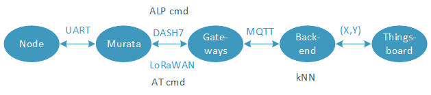
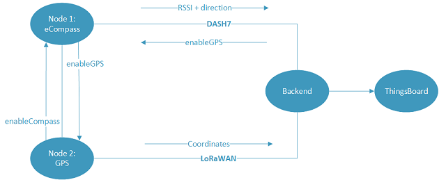

# lowpowTLJL: Monitoring Runaway Behavior

## Information
Internet of Things (IoT) project at the University of Antwerp

Course: I-IoT Low Power Embedded Communication

Master Students: Liam Oorts, Thomas Janssen, Lennert Van Hasselt &amp; Jonas Vercauteren

## Setup
Several technologies are used to localize the elderly in a health care center. The position can be monitored in indoor and outdoor environments. 

### Indoor localization 
To perform indoor localization, a DASH7 fingerprinting database (with RSSI as a metric) is created and a weighted kNN algorithm is used. The direction the person is facing to is calculated with an eCompass. This is a tilt-compensated compass with accelerometer and magnetometer. The position inside the health care center and direction are sent to the backend. If the person reaches the edge of the 'safe zone' an alarm is sent over DASH7 to enable the outdoor localization.

### Outdoor localization
To perform outdoor localization, GPS coordinates are sent over a LoRaWAN network to the backend. The GPS is low power sleep mode when disabled and sends coordinates in GPGGA format every 60 seconds. Besides latitude and longitude, HDOP is sent to the backend as well to get an idea of the accuracy of the measurements.

### Backend &amp; ThingsBoard
In the backend, all data is received via an MQTT broker. The fingerprinting algorithm runs in the backend.py script. When the person moves out of the safe zone, an alarm is triggered and the backend sneds a signal over DASH7 to enable the GPS of the node. All useful data is sent in a JSON string to [our Thingsboard](http://thingsboard.idlab.uantwerpen.be:8080/dashboards/6788ecf0-cace-11e7-9f1b-85e6dd10a2e8) to visualize the data.

## Power measurements
Power measurements are included in the presentation, which can be found in this repository.

